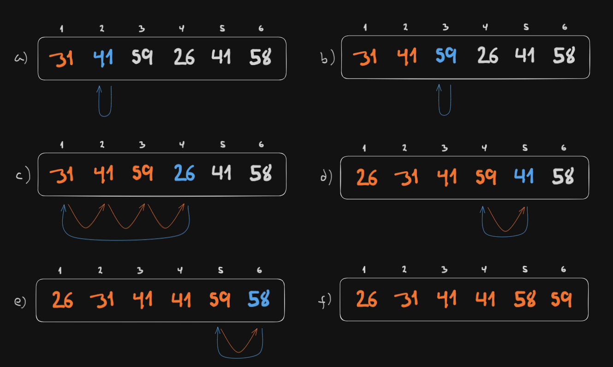

**2.1-1**

> Using Figure 2.2 as a model, illustrate the operation of INSERTION-SORT on an array initially containing the sequence $\langle 31, 41, 59, 26, 41, 58 \rangle$.



**2.1-2**

> Consider the procedure SUM-ARRAY on the facing page. It computes the sum of the $n$ numbers in array $A[1:n]$. State a loop invariant for this procedure, and use its initializaiton, maintenance, and termination properties to show that the SUM-ARRAY procedure returns the sum of the numbers in $A[1:n]$.

```
SUM-ARRAY(A, n)

sum = 0
for i = 1 to n
    sum = sum + A[i]
return sum
```

**Loop invariant:** The variable `sum` contains the sum of all the elements that have been iterated over so far.

**Initialization:** Since we're about to execute the first iteration, $i = 1$, so the variable `sum` should contain the sum of the first $i - 1 = 0$ elements of $A$, i.e., the empty sum which, by convention, is equal to $0$. This is the case, since the variable `sum` has previously been initialized to $0$.

**Maintenance:** The variable `sum` should contain the sum of the first $k$ elements of $A$ at the end of the $k$-th iteration of the loop, assuming that the loop variant holds before such iteration. This is the case, since the variable `sum`, which initially contains the sum of the first $k - 1$ elements of $A$, is incremented by the value of $A[k]$ at the end of the $k$-th iteration, thus containing the sum of the first $k$ elements of $A$.

**Termination:** The loop terminates as soon as $i > n$, i.e., when $i = n + 1$. By this point, according to the loop variant, the variable `sum` contains the sum of the first $i - 1 = n$ elements of $A$, i.e., the sum of all the elements of $A$. Therefore, the procedure returns the sum of the numbers in $A[1:n]$.

**2.1-3**

> Rewrite the `INSERTION-SORT` procedure to sort into monotically decreasing instead of monotonically increasing order.

```
INSERTION-SORT(A, n)

1   for i = n - 1 downto 1
2       key = A[i]
3       j = i + 1
4       while j <= n and A[j] > key
5           A[j - 1] = A[j]
6           j = j + 1
7   A[j - 1] = key
```

**2.1-4**

> Consider the *searching problem*:
>
> **Input:** A sequence of $n$ numbers $A = \langle a_1, a_2, \dots, a_n \rangle$ stored in array $A[1:n]$ and a value $x$.
>
> **Output:** An index $i$ such that $x = A[i]$ or the special value `NIL` if $x$ does not appear in $A$.

Write pseudocode for *linear search*, which scans through the array from beginning to end, looking for $x$. Using a loop invariant, prove that your algorithm is correct. Make sure that your loop invariant fulfills the three necessary properties.

```
LINEAR-SEARCH(A, x)

1   n = A.length
2   for i = 1 to n
3       if A[i] = x
4           return i
5   return NIL
```

**Loop invariant:** At the start of the $k$-th iteration of the `for` loop of lines 1-3, the first $k - 1$ elements of $A$ do not contain $x$.

**Initialization:** Since we're about to execute the first iteration, $i = 1$, so the first $i - 1 = 0$ elements of $A$ are the empty set, which trivially do not contain $x$.

**Maintenance:** Assuming that the loop invariant holds before the $k$-th iteration so that the first $k - 1$ elements of $A$ do not contain $x$, we need to show that the loop invariant holds before the $(k + 1)$-th iteration so that the first $k$ elements of $A$ do not contain $x$.

Two scenarios are possible during the $k$-th iteration:

1. $A[k] = x$. In this case, the algorithm returns $k$ and the algorithm inmediately terminates. Since there is no $(k + 1)$-th iteration, the loop invariant trivially holds.

2. $A[k] \neq x$. In this case, the algorithm continues to the $(k + 1)$-th iteration. Since the first $k$ elements of $A$ do not contain $x$ and $A[k] \neq x$, the first $k + 1$ elements of $A$ do not contain $x$. Therefore, the loop invariant holds before the $(k + 1)$-th iteration.

**Termination:** The loop terminates as soon as $i > n$, i.e., when $i = n + 1$. By this point, according to the loop invariant, the first $i - 1 = n$ elements of $A$ do not contain $x$, in other words, $x$ does not appear in $A$. The algorithm returns `NIL` in line 5, as expected.

The loop may also terminate in line 4 by returning some $i$ if $A[i] = x$, as expected.

**2.1-5**

> Consider the problem of adding two $n$-bit binary integers $a$ and $b$, stored in two $n$-element arrays $A[0:n-1]$ and $B[0:n-1]$, where each element is either $0$ or $1$, $a = \sum_{i=0}^{n-1} A[i] \cdot 2^i$, and $b = \sum_{i=0}^{n-1} B[i] \cdot 2^i$. The sum $c = a + b$ of the two integers should be stored in binary form in an $(n + 1)$-element array $C[0:n]$, where $c = \sum_{i=0}^{n} C[i] \cdot 2^i$. Write a procedure ADD-BINARY-INTEGERS that takes as input arrays $A$ and $B$, along with the length $n$, and returns $C$ holding the sum.

```
ADD-BINARY-INTEGERS(A, B, n)

new C[0:n]
sum = 0
carry = 0
for i = n-1 downto 0
    sum = A[i] + B[i] + carry
    if sum > 1
        C[i + 1] = sum - 2
        carry = 1
    else
        C[i + 1] = sum
        carry = 0
C[0] = carry
return C
```

(C++ implementation can be found [here](./cpp/2.1-5.cpp).)