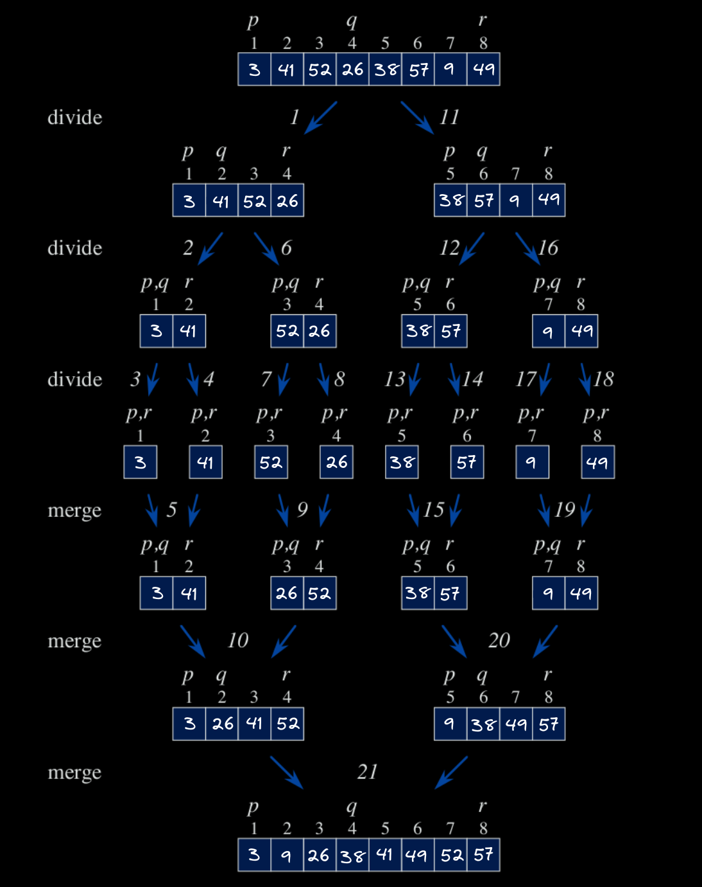

**2.3-1**

> Using Figure 2.4 as a model, illustrate the operation of merge sort on an array initially containing the sequence $\langle 3, 41, 52, 26, 38, 57, 9, 49 \rangle$.



**2.3-2**

> The test in line 1 of the `MERGE-SORT` procedure reads **if** $p \geq r$ rather than **if** $p = r$. If `MERGE-SORT` is called with $p > r$, then the subarray $A[p:r]$ is empty. Argue that as long as the initial call of `MERGE-SORT(A, 1, n)` has $n \geq 1$, the test **if** $p = r$ suffices to ensure that no recursive call has $p > r$.

Asumming that the initial call of `MERGE-SORT(A, 1, n)` has $n \geq 1$, the only way we could cause a recursive call to `MERGE-SORT` with $p > r$ is by first calling `MERGE-SORT` with $p = r$. Let's see what would happen if we called `MERGE-SORT(A, 1, 1)` with no initial tests:

```
MERGE-SORT(A, p, r)          // p = 1, r = 1
1   q = ⌊(p + r)/2⌋          // q = 1
2   MERGE-SORT(A, p, q)      // MERGE-SORT(A, 1, 1)
3   MERGE-SORT(A, q + 1, r)  // MERGE-SORT(A, 2, 1)
4   MERGE(A, p, q, r)
```

Observe that in line 2 we call `MERGE-SORT` with $p = r = 1$, a call identical to the current one. This would cause an infinite loop if no tests were present. 

But even if we somehow managed to avoid this, the call in line 3 would still be invalid, as it would have $p = 2$ and $r = 1$.

To avoid this whole situation, it's sufficient to add a test for $p = r$ in line 1 and return immediately if it's true.

```
MERGE-SORT(A, p, r)          // p = 1, r = 1
1   if p == r                // true
2       return               // returns immediately
3   q = ⌊(p + r)/2⌋
4   MERGE-SORT(A, p, q)
5   MERGE-SORT(A, q + 1, r)
6   MERGE(A, p, q, r)
```

Again, the reason it's unnecessary to test for $p > r$ is that the only way to reach a call with $p > r$ is by first calling `MERGE-SORT` with $p = r$.

We can have a look at other possible cases to confirm that none of them will directly cause a call with $p > r$:

- A call to `MERGE-SORT` with $r = p + 1$ will cause two recursive calls with $p = r$.

- A call to `MERGE-SORT` with $r = p + 2$ will a first recursive call with $r = p + 1$ and a second one with $p = r$.

- A call to `MERGE-SORT` with $r = p + 3$ will cause two recursive calls with $r = p + 1$.

Any call to `MERGE-SORT` with $r = p + c$ for some integer $c \geq 3$ will only cause direct recursive calls with $r > p$. We can show this by checking such condition on each of said recursive calls. For practicity, let's evaluate $q$ first:

$$
q = \lfloor \dfrac{p + (p + c)}{2} \rfloor
  = p + \lfloor \dfrac{c}{2} \rfloor
$$

1. `MERGE-SORT(A, p, q)` (line 4)

$$
\begin{align*}
c \geq 3 \Rightarrow \lfloor \dfrac{c}{2} \rfloor &\geq 0 \\
p + \lfloor \dfrac{c}{2} \rfloor &> p \\
q &> p \ \blacksquare
\end{align*}
$$

2. `MERGE-SORT(A, q + 1, r)` (line 5)

$$
\begin{align*}
c \geq 3 \Rightarrow \dfrac{c}{2} &> 1 \\
c - \dfrac{c}{2} &> 1 \\
c - 1 > \dfrac{c}{2} \Rightarrow c - 1&> \lfloor \dfrac{c}{2} \rfloor \\
p + c &> p + \lfloor \dfrac{c}{2} \rfloor + 1\\
r &> q + 1 \ \blacksquare
\end{align*}
$$

With our current test (lines 1-2), any calls to `MERGE-SORT` with $p = r$ will return before causing any recursive calls with $p > r$.

**Note:** In the fourth edition, both instances of $p = r$ in this question are actually $p \neq r$. This is a typo, as stated in the [official errata](https://mitp-content-server.mit.edu/books/content/sectbyfn/books_pres_0/11599/e4-bugs.html).

**2.3-3**

> State a loop invariant for the **while** loop of lines 12-18 of the `MERGE` procedure. Show how to use it, along with the **while** loops of lines 20-23 and 24-27, to prove that the `MERGE` procedure is correct.